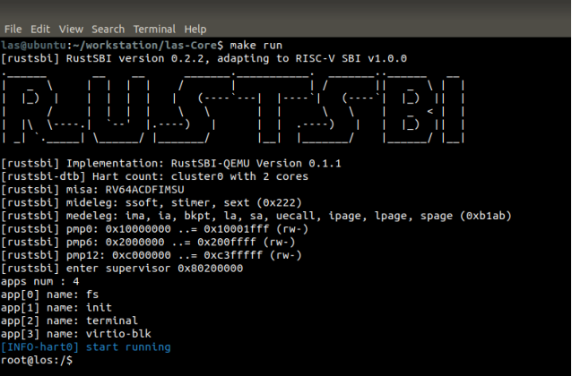

### los

a minix-like microkernel written in rust.


### requirement

- qemu(qemu 7.0 work well)

- rust(nightly-2022-04-02) and related stuff:

  ```
  rustup target add riscv64gc-unknown-none-elf
  cargo install cargo-binutils --vers =0.3.3
  rustup component add llvm-tools-preview
  rustup component add rust-src
  ```


### run

qemu:

```shell
make all && make run
```

k210:

```shell
export BOARD=k210
make sdcard # you might need to modify $(SDCARD) in Makefile
make all && make run
```





### about

los implements following stuff:

- basic process control and IPC for microkernel
- memory management - higher half kernel
- userspace drivers and VFS server
- subset of linux system call
- some linux-like command line tools

Besides, los has:

- a very bad performance
- unknown kernel bugs
- unsafe system calls
- … who knows :)

